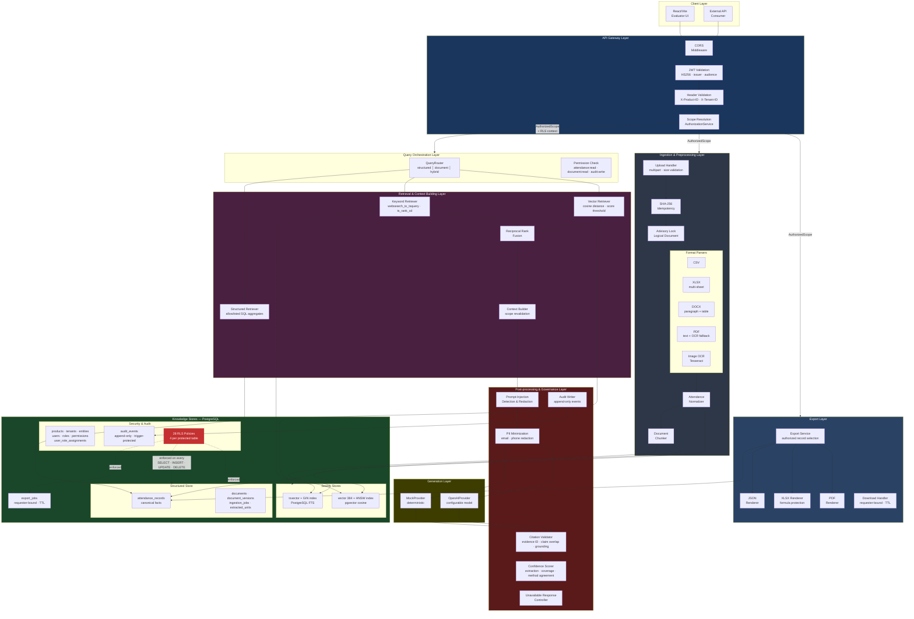
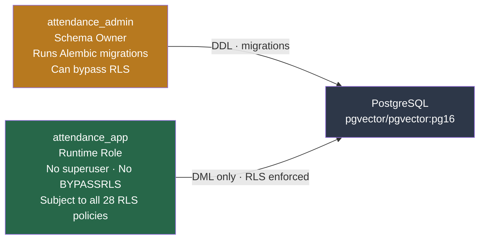

# Architecture

This document maps the implementation to the reference architecture layers and shows
where isolation is enforced.

## System Architecture

## Isolation Enforcement Points

The diagram below shows where the mandatory isolation context
(`product_id`, `tenant_id`, `entity_id`, `module`, RBAC, classification) is enforced.
The non-negotiable rule — **the model never decides access** — is satisfied by enforcing
all filters before context reaches the generation layer.

```mermaid
flowchart LR
    REQ["Incoming<br/>Request"] --> GW["Gateway<br/>JWT + Headers"]

    GW -->|"Principal"| AUTH["Authorization<br/>Service"]
    AUTH -->|"AuthorizedScope<br/>grants resolved<br/>from database"| RLS_CTX["PostgreSQL<br/>RLS Context<br/>set_config()"]

    RLS_CTX --> LAYER{"Retrieval<br/>Layer"}

    LAYER -->|"product_id<br/>tenant_id<br/>entity_id<br/>module<br/>classification ≤ ceiling"| SQL["SQL<br/>Predicates"]
    SQL -->|"defense in depth"| PG_RLS["PostgreSQL<br/>RLS Policies"]

    PG_RLS -->|"only permitted<br/>rows returned"| CTX_BUILD["Context<br/>Builder"]
    CTX_BUILD -->|"re-validates scope<br/>sanitizes content"| LLM["LLM<br/>Provider"]

    LLM -->|"raw output"| POST["Post-processing<br/>citation validation<br/>confidence gating"]

    POST -->|"validated answer<br/>or controlled<br/>unavailable"| RESP["Response"]

    style GW fill:#1a365d,color:#fff
    style AUTH fill:#2a4365,color:#fff
    style RLS_CTX fill:#c53030,color:#fff
    style PG_RLS fill:#c53030,color:#fff
    style SQL fill:#9b2c2c,color:#fff
    style CTX_BUILD fill:#4a2040,color:#fff
    style POST fill:#5a1a1a,color:#fff
```

### Enforcement summary

| Layer | Mechanism | What it prevents |
|---|---|---|
| Gateway | JWT validation, `X-Product-ID` / `X-Tenant-ID` headers | Unauthenticated or unscoped requests |
| Authorization | `AuthorizationService.resolve_scope()` from database | Forged or expired role claims |
| Application predicates | Explicit `WHERE` clauses on every query | Broad retrieval before filtering |
| PostgreSQL RLS | 28 row-level policies + `app_scope_allows()` function | Application bugs leaking rows |
| Context builder | Re-validates chunk ownership + scope | Stale or manipulated evidence IDs |
| Post-processing | Citation validation, confidence gating, unavailable controller | Hallucinated citations, low-confidence answers |

## Database Role Separation

## Technology Stack

| Responsibility | Technology | Substitution rationale |
|---|---|---|
| API framework | FastAPI 0.115 | Async-capable, auto-generated OpenAPI, Pydantic-native |
| Database | PostgreSQL 16 via pgvector image | Single store for structured data, full-text search, and vector embeddings |
| Vector search | pgvector 0.8 | Eliminates separate vector DB; HNSW indexing in PostgreSQL |
| Full-text search | PostgreSQL `tsvector` + GIN | No Elasticsearch needed; integrated with RLS |
| Embeddings | sentence-transformers/all-MiniLM-L6-v2 | Free, local, no API key required; 384-dimensional |
| LLM generation | Configurable: Mock (default) or OpenAI | Mock enables deterministic testing; OpenAI for production |
| OCR | Tesseract via pytesseract | Free, local; no cloud dependency |
| Authentication | PyJWT (HS256) | Lightweight; production would use RS256 + JWKS |
| Migrations | Alembic | Standard SQLAlchemy migration tool |
| Frontend | React 18 + TypeScript + Vite 6 | Minimal evaluator UI; not the primary deliverable |
| PDF export | ReportLab 4 | Professional table rendering |
| XLSX export | openpyxl 3 | Formula-injection protection built in |
| Container | Docker Compose v2 | One-command local startup |
